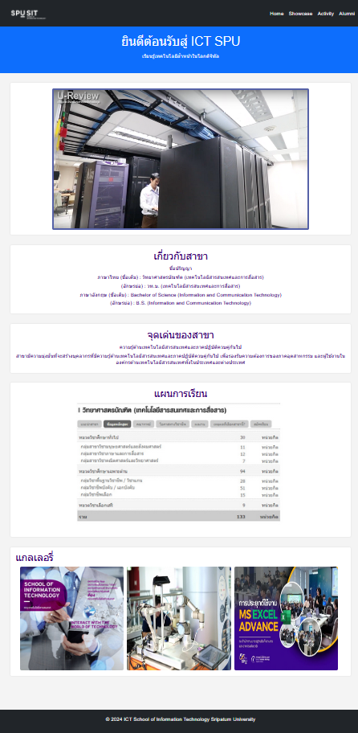
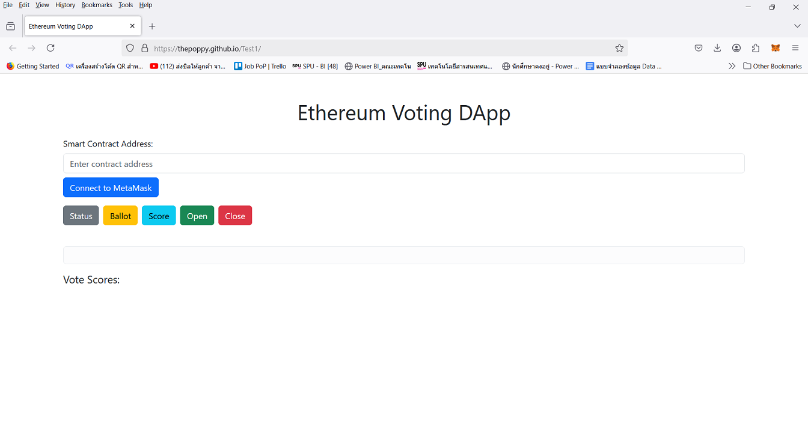

# College-ERP
A college management system built using Django framework. It is designed for interactions between students and teachers. Features include attendance, marks and time table.

## Installation

Python and Django need to be installed

```bash
pip install django
```

## Usage

Go to the College-ERP folder and run

```bash
python manage.py runserver
```

Then go to the browser and enter the url **http://127.0.0.1:8000/**

📸 Website Preview

### Home Page


### Showcase Page


### Activity Page


### Alumni Page


### Ethereum Voting DApp Page

